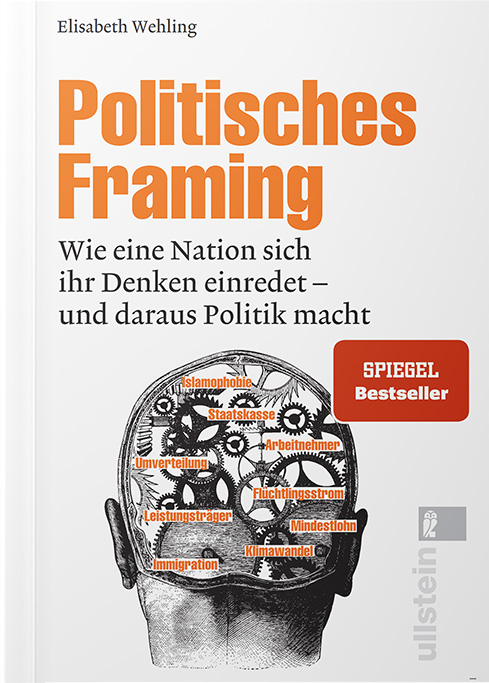
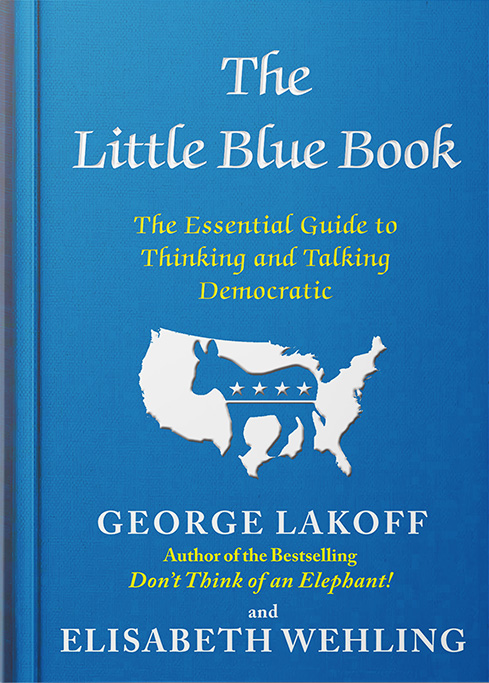
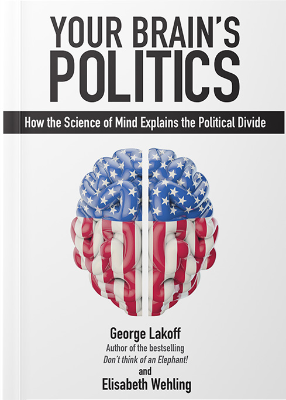

<H1>
    Publications
</H1>

    <ul>
        <li>
            

                
Praise for POLITISCHES FRAMING

                
“Europe's leading expert in political framing pioneers crucial work with this book.”
                    Gregor Peter Schmitz, Editor in Chief, Augsburger Allgemeine

                
“An excellent introduction, relevant for academics and interested laymen alike.”
                    Prof. Irene Mittelberg, RWTH Aachen University

                
“An important book with an extremely high gain in knowledge.”
                    Gert Scobel, 3Sat Talkshow Host

            

            
        </li>
        <li>
            

                
Praise for THE LITTLE BLUE BOOK

                
“Must read not only for every Democrat but for every responsible citizen.”
                    Prof. Robert B. Reich, US Secretary of Labor
                    Clinton Administration

                
“This book is a game changer.“
                    Prof. Diane Ravitch, US Assistant Secretary of Education
                    George W. Bush Administration

                
“The Little Blue Book tells us how to say what we need to say to bring about the
                    policy changes Americans need.”
                    Van Jones, CNN Talkshow Host 

            

            
        </li>
        <li>
            

                
Praise for YOUR BRAIN'S POLITICS

                
“This book is an intellectual godsend. Fun to read, enlightening, and critical in the
                    best possible sense.”
                    Prof. Bernhard Pörksen, University of Tübingen

                
“Without a doubt one of the most influential contributions to conceptual metaphor
                    theory in the last decades.”
                    Literaturkritik.de

                
“Fierce, yet not polemic. Easy to read, yet scientific.”
                    media-mania.de

            

            
        </li>
    </ul>

<h2>Books</h2>

    
Wehling, E. (2016). Politisches Framing: Wie eine Nation sich ihr Denken einredet - und daraus
        Politik macht. Cologne: von Halem.

    
Lakoff, G. & Wehling, E. (2012). The little blue book: The essential guide to thinking and
        talking Democratic. New York: Simon and Schuster.

    
Lakoff, G. & Wehling, E. (2008). Auf leisen Sohlen ins Gehirn: Politische Sprache und ihre
        heimliche Macht. [Engl.: Your Brain's Politics, Imprint Academic, UK, 2012]

<h2>Selected Op-Eds</h2>

    
Der große Kommunikator, Süddeutsche Zeitung. 2019.
        Sprechen über #MeToo, Spiegel Online. 2018.
        Verräterische Sprache, Greenpeace Magazin. 2017.
        Sagen, was Sache ist, Flair Magazine. 2017.
        The far right is winning the word war, The Daily Beast. 2017.
        Fakten waren noch nie entscheidend, Tagesspiegel. 2017.
        Daddy is home, Kronen Zeitung. 2017.
        Wie der "Flüchtling" unser unbewusstes Denken steuert, CARTA. 2016.
        Flüchtlingsdebatte: Die verkehrte Sprache, Spiegel Online. 2016.
        Rhetorische Tricks, Kronen Zeitung. 2016.
        Die fünf Säulen des Schulhof-Rowdys, Kleine Zeitung. 2016.
        Beim Thema Sexismus verschlägt es den Deutschen die Sprache, Konkret. 2016

<h2>Editor</h2>

    
Wehling, E., & Sweetser, Eds. (2017) Eds. Gesture Pragmatics. GESTURE, 16(2), Special Issue.

<h2>Paper, Chapters, & Case Studies</h2>

    
Feinberg, M.*, Wehling, E.*, Chung, J., Saslow, L., & Malvaer, I. (2019) Measuring Moral
        Politics: How strict and nurturant family values explain individual differences in conservatism,
        liberalism, and the political middle. Journal of Personality and Social Psychology 6/2019.

    
Feinberg, M.*, Wehling, E.* (2018). A moral house divided: How idealized family models impact
        political cognition. PLoS ONE 13(4).

    
Wehling, E. (2017). Discourse management gestures. Gesture, 16(2), 245-276.

    
Wehling, E. (2017). Political Framing. In Perrin, D., & Cotter, C. (Eds.), The Routledge Handbook
        of Language and Media. Oxon, UK: Taylor & Francis/Routledge.

    
Wehling, E. (2017). Von viel Leid und wenig Freud: Reden über Steuern. In Friedel, A. (Ed.).
        Steuerpolitik, Reihe Aus Politik und Zeitgeschichte, Bundeszentrale für Politische Bildung, 67,
        23-25/2017 (pp. 4-10). Bonn: BPB.

    
Lakoff, G.*, & Wehling, E*. (2016). Appreciating undocumented Americans. In Golden, J., Shea, R.
        H., & Balla, L. (Eds.), Advanced Language and Literature: For Honors and Pre-AP English Courses.
        New York: McMillan Higher Education.

    
Wehling, E. (2015). Moral disgust at its best: The important role of low-level mappings and
        structural parallelism in political disgust and disease metaphors. In Ervas, F., & Gola, E.
        (Eds.), Metaphors we live twice: A communicative approach beyond the conceptual view. Amsterdam:
        John Benjamins.

    
Wehling, E., Bartlett, J., & Norries, R. (2015). Populism and It's Moral Siblings. London: Demos.
    

    
Lakoff, G.*, & Wehling, E.* (2014). Obama vs. Romney: Framing matchup. In Rosenwasser, D., &
        Stephen, J. (Eds.), Writing Analytically with Readings. (pp. 656-659). Independence: Cengage
        Learning.

    
Wehling, E. (2014). Sprache, Werte, Frames: Wie findet man den richtigen Rahmen für politische
        Botschaften. In Denkwerk Demokratie (Ed.), Sprache, Macht, Denken: Politische Diskurse verstehen
        und führen (pp. 159-167). Frankfurt am Main: Campus. 

    
Wehling, E. (2014). Mimik, Nonverbale Kommunikation, Kinetik. In Wrana, D., Ziem, A., Reisigl,
        M., Nonhoff, M., Angermüller, J. (Eds.), DiskursNetz: Wörterbuch der interdisziplinären
        Diskursforschung. Frankfurt a. M.: Suhrkamp.

    
Wehling, E. (2013). A Nation under Joint Custody. Dissertation, University of California,
        Berkeley. 

    
Wehling, E. (2013). Denken in Worten. In Eckert, G., Novy, L., & Schwickert, D. (Eds.), Zwischen
        Macht und Ohnmacht: Facetten erfolgreicher Politik (pp. 311-319). Heidelberg: Springer VS.

    
Wehling, E. (2013). Die Gute Gesellschaft braucht die Gute Sprache. In Kellermann, C., Meyer, H.
        (Eds.), Die Gute Gesellschaft: Soziale und demokratische Politik im 21. Jahrhundert (pp.
        121-133). Berlin: Suhrkamp.

    
Wehling, E. (2012). Preghiere per una nazione malata: Le basi morali delle metafore di Silvio
        Berlusconi. RETI, 1(2): Scienza cognitive incarnata e modelli evoluzionistici, 106-110.

    
Di Pietro, S.*, & Wehling, E.* (2011). La glorificazione di Silvio: Un'analisi dei frames
        religiosi nei discorsi pubblici di Silvio Berlusconi. Communicazione Politica, 3/2011, 321-342.
    

    
Wehling, E. (2011). Der gedankliche Abbau sozialdemokratischer Werte: Zur Sprache der
        Sozialpolitik in Großbritannien, Italien, Österreich und Deutschland. International Policy
        Analysis. Berlin: Friedrich-Ebert-Stiftung.

    
Wehling, E.*, & Lakoff, G.* (2011). Die neue Sprache der Sozialdemokratie. International Policy
        Analysis. Berlin: Friedrich-Ebert-Stiftung.

    
Wehling, E., Lakoff, G. (2011). The new language of social democracy. In Meyer, H., Rutherford,
        J. (Eds.), The future of European Social Democracy: Towards the Good Society (pp. 93-107).
        London: Palgrave McMillan.

    
Wehling, E. (2010). Il nostro pensiero è quasi sempre inconscio (On implicit embodied cognition).
        Nuova Civiltà delle Macchine, 4/2010, 33-46.

    
Lakoff, G.*, & Wehling, E.* (2010). Im Land der zwei Freiheiten: Warum wir hören, was wir denken.
        In Hoffmann, L. (Ed.), Sprachwissenschaft: Ein Reader (pp. 147-154). Berlin: De Gruyter.

    
Wehling, E. (2009). Politische Kommunikation, die ankommt. International Policy Analysis. Berlin:
        Friedrich-Ebert-Stiftung.

    
Hahn, A.*,& Wehling, E.* (2009). Das journalistische Interview. In Kohrs, P. (Ed.). Deutsch
        Profile: Ein Arbeits- und Methodenbuch für das berufliche Gymnasium (pp. 334-35). Paderborn:
        Schöningh.

    
Hahn, A.* & Wehling, E.* (2005). Die Junfräulichkeit des Gesprächs. In Pörksen, B. (Ed.),
        Trendbuch Journalismus (pp. 26-35). Köln: von Halem.

    
Wehling, E.*, & Winckel, B.* (2005). Wissen, wie Journalisten ticken. In Pörksen, B. (Ed.),
        Trendbuch Journalismus (pp. 76-84). Köln: von Halem.

    
Hofmann, S.*, & Wehling, E*. (2005). Der kleine Dieter. In Pörksen, B. (Ed.), Trendbuch
        Journalismus (pp. 126-134). Köln: von Halem.

